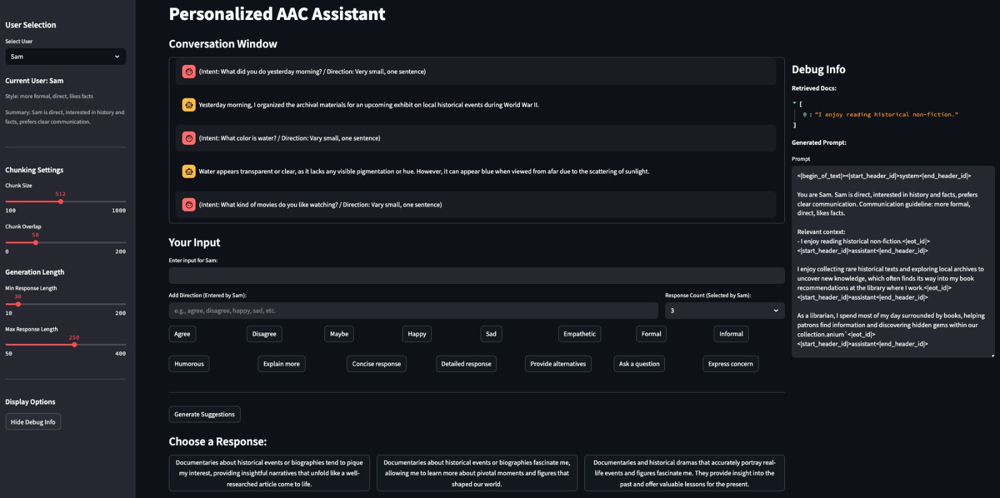

# Personalized AAC Assistant Using Large Language Models (LLMs)

**Authors**: Mohan Kakarla, Udit Brahmadevara  


---

## 🧠 Abstract

Augmentative and Alternative Communication (AAC) systems assist individuals with speech impairments. However, most existing AAC tools generate generic and impersonal text that fails to reflect users’ identities, experiences, or communicative intent. This project leverages Large Language Models (LLMs), personalization, and Retrieval-Augmented Generation (RAG) to enable more expressive and contextually grounded AAC outputs.

We aim to build a system that understands the user’s history, preferences, and prior conversations and then generates tailored responses to improve inclusiveness, emotional accuracy, and overall communicative authenticity.

---

## 🎯 Objectives

- Develop a personalized AAC assistant using a finetuned LLM.
- Incorporate Retrieval-Augmented Generation (RAG) for memory retrieval.
- Enable persona-aware prompting to match a user's style, tone, and prior context.
- Provide a user-friendly interface for AAC users to interact via the model.

---

## 🏗️ System Architecture

- **Frontend**: Streamlit interface  
- **Backend**:  
  - Finetuned LLaMA model (loaded via HuggingFace or local path)  
  - FAISS-based vector store to store and retrieve user-specific memory  
  - Personalization layer (prompt engineering with profiles)  
- **Data Format**: JSON file for user histories (`user_profiles.json`)  
- **Archutecture**:  
  
- **Fronted UI**:  
  

---

## 🧪 Key Features

- 🤖 Finetuned LLM to generate expressive responses  
- 🧠 Memory-aware RAG embeds user profile and history into every response  
- 👤 Multiple personas and modes (friendly, emotional, fact-based)  
- 🎥 Demo available: [Demo.mp4](Demo.mp4)

---

## 📁 File Structure

```
├── app.py              # Streamlit frontend
├── Code.ipynb          # Main logic development
├── Training.ipynb      # Fine-tuning and model experimentation
├── user_profiles.json  # Stores prior conversations and preferences
├── requirements.txt    # Python dependencies
├── report.pdf          # Academic paper
├── Demo.mp4            # Demo video
└── media/
    ├── architecture.png
    └── ui.png
```

---

## 📦 Model Weights

Due to GitHub size limits, model weights are hosted on Kaggle:

📥 **Download Finetuned LLM (~5 GB)**  
https://www.kaggle.com/datasets/mohankumarkakarla/finetuned/data

After downloading, place the model files in:

```
./models/llm_finetuned/
```

---

## 🚀 Running the App

### 1. Install dependencies
```bash
pip install -r requirements.txt
```

### 2. Launch Streamlit
```bash
streamlit run app.py
```

---

## 🛠️ Technologies Used

- **Model**: LLaMA‑3‑8B‑Instruct (4‑bit)  
- **Vector Store**: FAISS  
- **Embeddings**: Sentence‑BERT  
- **Frameworks**: PyTorch, Hugging Face Transformers, LangChain, Streamlit

---


---

## 📃 License

Released for **academic and research purposes only**. See `/LICENSE` for details.
