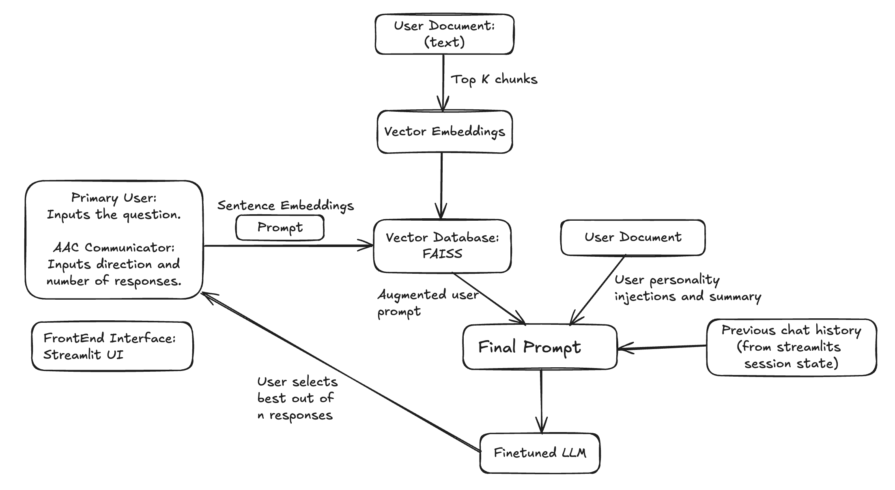

# 🧠 Personalized AAC Assistant using LLMs

This project presents a **Personalized Augmentative and Alternative Communication (AAC) Assistant**, designed to help individuals with speech impairments generate expressive, personalized responses using a fine-tuned Large Language Model (LLM). It integrates **Retrieval-Augmented Generation (RAG)**, **user memory**, and **LLM prompting** to simulate natural, context-aware conversation.

---

## 🧾 Abstract

Current AAC tools produce generic and impersonal outputs that often fail to reflect the personality, intent, and experiences of the user. This system overcomes those limitations by:
- Embedding user memories and personality traits
- Dynamically retrieving relevant content using FAISS
- Injecting context into prompts for an LLM
- Generating multiple personalized responses for user selection

The project contributes toward inclusive communication technologies powered by state-of-the-art NLP.

---

## 🧱 System Architecture



---

## 🖥️ Application Interface


Users can:
- Select predefined user profiles
- Control chunk size, overlap, and generation length
- Define emotional tone and intent
- Preview multiple AI-generated suggestions

🎥 [Demo Video](./Demo.mp4)

---

## 📁 Project Structure

```
.
├── app.py                      # Streamlit app for interaction
├── Code.ipynb                  # Prompt assembly and vector retrieval logic
├── Training.ipynb              # Sentence embedding + FAISS index builder
├── user_profiles.json          # Predefined users with traits and memories
├── report.pdf                  # Full academic report
├── Demo.mp4                    # Video walkthrough of the assistant
├── requirements.txt            # Python dependencies
└── media/
    ├── architecture.png        # System pipeline architecture
    └── aac_ui.png              # Screenshot of UI interface
```

---

## 🔍 Technologies Used

- **Model**: LLaMA-3-8B-Instruct-bnb-4bit (finetuned, 5GB)
- **Frontend**: Streamlit
- **Retrieval**: FAISS + SentenceTransformers
- **Prompt Injection**: LangChain
- **Embeddings**: Sentence-BERT

---

## 🚀 How to Run

```bash
git clone https://github.com/your-username/aac-personalized-assistant.git
cd aac-personalized-assistant

# Optional: Setup virtual environment
python -m venv venv
source venv/bin/activate

# Install dependencies
pip install -r requirements.txt
```

### 🔗 Download the Finetuned Model

📦 Download from Kaggle (~5GB):  
https://www.kaggle.com/datasets/mohankumarkakarla/finetuned/data

Extract and place contents into:

```
./models/llm_finetuned/
```

Then launch the app:

```bash
streamlit run app.py
```

---

## 📘 Academic Report

📄 [report.pdf](./report.pdf)  
🧑‍🏫 Developed for “LLMs for Societal Good” coursework at SUNY Buffalo.

---

## 👤 Contributors

- **Aravind Aripaka** — NLP Engineering, Streamlit UI, Prompt Design  
- **Mohan Kakarla**, **Udit Brahmadevara** — Memory modeling, Report writing, Model integration

---

## 🔐 License

This repository is provided for academic and research purposes only.

---

## 📦 Requirements

See [requirements.txt](./requirements.txt) for the full dependency list.
